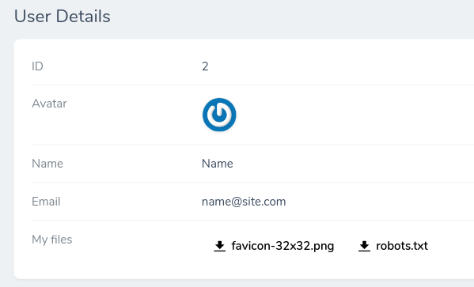
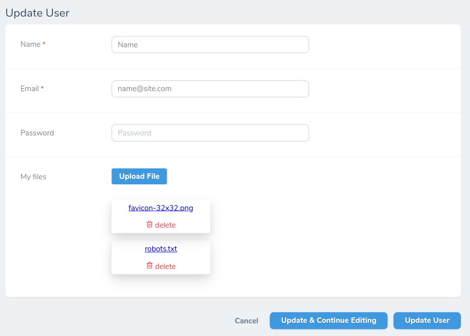

# Laravel Nova Field - Secure Array Files

## Description

A Laravel Nova field that secure save your files into an array of objects and download from response

<p align="center">
  
</p>

# Installation
```
composer require movex-ukraine/secure-array-files
```

# Usage
Create array files just call `MovexUkraine\SecureArrayFiles\SecureArrayFiles` class and use `make` static method to create a field.
```
...
use MovexUkraine\SecureArrayFiles\SecureArrayFiles;
...
public function fields(Request $request)
    {
        return [
            ...
            SecureArrayFiles::make('My files', 'files')
                ->disk('local')
                ->path('my_attachments'),
            ...
        ];
    }
...
```
That will create a field with name `My files`. Stored data will look like this.

<p align="center">
  
</p>

```
[{
    "originalName":"favicon-32x32.png",
    "name":"my_attachments/2020-05-24_Yagdk7OFLNq3jb3wYp82LWmHtNNPOqc9VHGTdmkb.png",
    "url":"/storage/my_attachments/2020-05-24_Yagdk7OFLNq3jb3wYp82LWmHtNNPOqc9VHGTdmkb.png"
},
{
    "originalName":"robots.txt",
    "name":"my_attachments/2020-05-24_Rt1fHaMvxePXiH1NDqW6jBbwUR2yknVASfQQo0Kq.txt",
    "url":"/storage/my_attachments/2020-05-24_Rt1fHaMvxePXiH1NDqW6jBbwUR2yknVASfQQo0Kq.txt"
}]
```

# Notes
- make sure you have specified correct `APP_URL` on your application
- make sure you have specified default `FILESYSTEM_DRIVER=local` on your application

## License

The Laravel Nova Field - Secure Array Files is open-sourced software licensed under the [MIT license](https://opensource.org/licenses/MIT).
